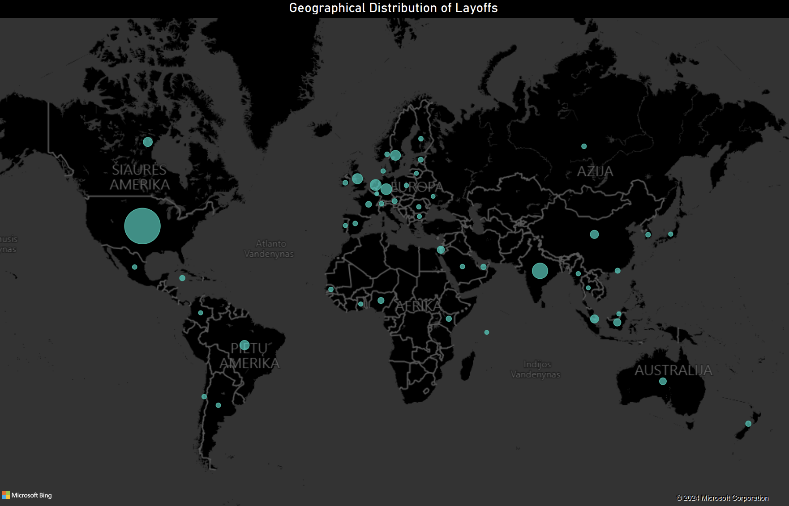

# Layoffs Analysis

## Overview
The "Layoffs Analysis" project is a Python-based tool for analyzing and visualizing layoff trends across various industries, 
companies, and locations over time. Utilizing data sourced from layoffs during the recent economic changes in the tech industry,
the project aims to provide insights into employment dynamics.

## Dataset Description
This analysis utilizes a dataset that chronicles layoffs in the tech industry, 
reflecting the economic challenges faced since the COVID-19 pandemic 
(from March 11, 2020, to October 16, 2023). Economic factors such as decreased consumer spending, 
higher central bank interest rates, and strong international dollar values have pressured tech firms, 
leading to significant layoffs. Notably, companies like Meta have reduced their workforce substantially. 
The dataset, originally curated by Roger Lee, compiles information from sources like Bloomberg, TechCrunch, 
and The New York Times. Complete data is available on [Layoffs.fyi](https://www.kaggle.com/datasets/swaptr/layoffs-2022/data).

## Requirements
- Python 3.x
- Libraries: pandas, sqlite3, matplotlib
- PowerBI

## Features
The script provides interactive visualizations in four key areas:
1. **Industries with the Highest Count of Companies with Layoffs**
2. **Companies with the Highest Sum of Layoffs**
3. **Total Layoffs by Quarter**
4. **Locations with the Highest Sum of Layoffs**

### Graph Analysis
Each graph offers a unique perspective:
- **Top Industries**: Indicates which sectors are most affected.
- **Top Companies**: Highlights companies facing the largest layoffs.
- **Quarterly Analysis**: Shows trends and patterns in layoffs over time.
- **Geographical Impact**: Reveals locations with the most layoffs.

## Data Source
The project analyzes data from 'layoffs.csv', sourced from Kaggle's "Tech Layoffs 2022" dataset. 
This dataset spans from March 11, 2020, to October 16, 2023, 
providing a comprehensive view of layoffs in the tech industry during this period. 
The data is compiled from various reputable sources and credited to Roger Lee.

## Visual Data Analysis

### Top 10 Industries with the Highest Count of Companies with Layoffs

This bar chart visualizes the industries most impacted by company layoffs. 
The Finance industry has the highest count, suggesting extensive layoffs, with Healthcare following. 
The order of the bars provides a quick comparative view, 
illustrating the resilience or vulnerabilities across different sectors during the economic downturn.

### Top 10 Companies with the Highest Sum of Layoffs

The chart highlights companies with the highest reported layoffs. Amazon leads, 
followed by Meta and Google, indicating the scale of workforce reductions in these tech giants. 
This graph reflects the restructuring efforts and the broader economic pressures faced by these corporations.

### Total Layoffs by Quarter

The total number of layoffs per quarter from early 2020 to late 2023 is depicted in this bar chart. 
Notably, the second quarter of 2023 shows a significant spike in layoffs, 
possibly related to economic factors or industry shifts. 
The chart provides insight into the cyclical nature of layoffs and potential correlations with economic events.

### Top 10 Locations with the Highest Sum of Layoffs

Focusing on the geographical distribution of layoffs, 
this graph reveals the San Francisco Bay Area as the most affected location, 
with Seattle and New York City also experiencing high numbers. 
The concentration of tech industry layoffs in these regions is indicative of the sector's presence 
and the localized economic impacts of job cuts.

### Amount of Layoffs by Countries

This map visualizes the geographical distribution of layoffs across the globe, 
with data points represented by circles whose size corresponds to the number of layoffs in that location. 
The largest circle, prominently placed over North America, 
indicates a significantly higher number of layoffs in comparison to other regions. Europe, Asia, and South America 
also show notable activity, albeit to a lesser extent. 

The map has been created using Power BI, offering an interactive way to explore the data by regions and countries. 
This visualization highlights the global impact of the economic downturn on the tech industry, 
with some regions being more affected than others. It provides a stark representation of the layoffs' reach, 
emphasizing areas that may be experiencing more profound economic shifts or industry-specific challenges.

_Note: The map was generated using Power BI, which allows for dynamic and interactive data exploration. 
The version shown here is a static image exported from the Power BI platform._

Each graph provides a distinct perspective on the layoffs, 
contributing to a multifaceted understanding of the employment challenges during the examined timeframe.

## Conclusion

Through a comprehensive analysis of layoffs data visualized across various graphs, 
we observe that the economic challenges faced by the tech industry have led to significant layoffs, 
with notable disparities across industries, companies, locations, and time periods. 
The United States stands out with the highest sum of layoffs, being disproportionately higher than any other country, 
and accounting for a significant majority of layoffs worldwide. The data reveals a broad range of